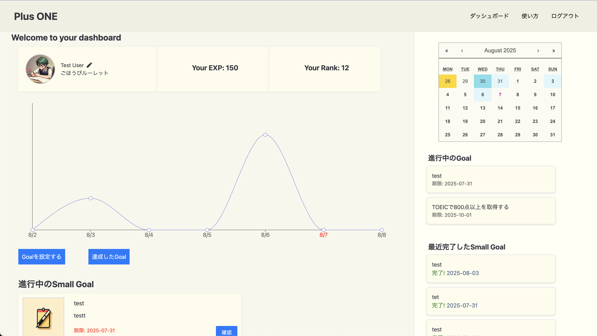

## はじめに

日々の積み重ねを記録しそれが数字として積もっているのを実感したく、PlusONEというタスク管理アプリを作成しました。
タスク管理と名打てば、タスクを作成してそれが期限までに達成できるかを管理するというものと、なんとなくイメージが湧くかと思います。
そういった機能を軸として添えながらも、目的としては日々の研鑽が数字として積み重なっていくことを実感できることが目的のサービスです。

# PlusONE 使い方ガイド

## 概要

**PlusONE**は、Goal（目標）を設定し、日々の進捗を可視化できるタスク管理アプリです。  
EXP（経験値）とごほうびルーレット機能があり、ゲーム感覚で自身の成長を記録していきます。

## 1. ダッシュボードの見方

ログイン後、ダッシュボード画面に遷移されます。
- **左上**：ユーザー情報（名前・プロフィール画像・EXP・Rank）
- **中央**：経験値の推移グラフ（EXPの増減が日付ごとに表示されます）
　　　赤字が今日の日付です。
- **右上**：カレンダー（色の濃淡でその日の進捗度合が表示されます）
　　　赤字が今日の日付です。
- **右下**：進行中のGoal（目標名と締切日がリスト表示されます）

## 2. Goal（目標）の設定
1. ダッシュボード下部の「目標を設定する」ボタンをクリック
2. 目標のタイトル・目標の内容・期限を入力して「設定する」をクリックして保存
3. 保存したGoalの詳細ページに遷移します

## Goalページ
1.Goalの内容が編集できます
2.Small Goalの作成ができます

## 3. Small Goal（小目標）の設定

1. 目標詳細ページの「Small Goalの作成」をクリックすると、Small Goalを設定できます
2. Small Goalのタイトル・Task・Small Goalの難易度・期限を入力して「設定する」をクリックして保存

※Small Goalは必須ではありません。Goalを達成するために、その道標になるのがSmall Goalです。Small Goalを作成する際、Taskの設定は必須です。

※Small Goalの難易度はなんとなくで問題ありません。難易度によって獲得するEXP（経験値）が変わりますが、大事なのは日々積み重ねができているかです。

Tips：目標達成への道をなるべく細かく設定するのが理想ですが、大雑把でも問題なく、むしろ1日で完了できる小さな目標をSmall Goalで設定してみてください。

GoalとSmall Goal・タスクの例　
Goal: TOEICで800点以上を取得する
Small Goal : 基礎文法をマスターする
期限: 2日後
タスク:
・現在, 過去進行形をおさらいする
・現在, 過去進行形の問題を10問解く
・間違えた問題をノートにまとめる

## 4. Goalの達成

- Goalを達成したら「達成したGoal」ボタンから達成したGoalの一覧を確認できます
- 達成するとEXP(経験値)が増え、またRankが上がります
- Rankが10を超えると「ごほうびルーレット」を回せるようになります

---

## 5. カレンダー

- カレンダーには、その日獲得したEXPの量に応じて色が変わります
- ピンク字になっているのが、今日の日付です

## 機能一覧
### 認証
- AWS Amplify を利用したユーザー登録／ログイン／ログアウト
- ログイン状態の判定と保護ルーティング（未ログイン時は /login へリダイレクト）

### ダッシュボード
- プロフィール表示（ユーザー名・アバター・累計EXP・現在のランク）
- 最新の達成 Goal 一覧表示
- EXP カレンダー：１日ごとの獲得 EXP をヒートマップで可視化
- EXP 折れ線グラフ：直近１週間の EXP 推移を表示
- Goal 一覧（進行中／完了）と操作ボタン

### Goal 管理
- Goal 作成（タイトル・内容・期限）
- Goal 編集／削除
- Goal 詳細ページ /goals/[goalId] で Small Goal やタスクを紐づけて管理
- Goal 完了時は「Completed Goals」ページに自動で移動

### Small Goal & タスク管理
- Goal を細分化した Small Goal の作成・編集・削除
- Small Goal 内のタスク進捗管理
- Small Goal/タスク完了で EXP 加算

### ランク & EXP システム
- Goal、Small Goal達成で EXP を付与
- EXP が一定値に達するとランクアップ
- ランク10を超えると「ごほうびルーレット」が解放

### ごほうびルーレット
- チケットを１枚消費してルーレットを回せる
- 12 セグメントのホイールが停止した位置番号からごほうびテキストを取得
- 結果はモーダルで表示
- API 連携でチケット残数を管理しスピン後に更新

### チケット管理
- 現在のチケット枚数を管理
- ルーレットスピン時にチケットを 1 枚消費

### ルーレットテキスト編集
- ルーレットの数字に対応するテキストを好きなように編集できる

### ユーザー名編集
- ダッシュボードからユーザー名を変更 

## 使用技術

| フロントエンド |
| -------------- |
| React.js (Next.js) 　|
| React Calendar （カレンダー UI）　|
| Recharts （EXP 折れ線グラフ）　|
| eslint　 |
| Jest ＋ React Testing Library（ユニット / コンポーネントテスト）　　|

| バックエンド |
| ----------------- |
| Ruby 3.2.8 |
| Rails 7.0.7.2 |
| RuboCop（コード解析） |
| RSpec（自動テスト）|
| Puma（APサーバー） |
| MySQL 8.0.42 |

| インフラ |
| -------------- |
| Docker/docker-compose|
| AWS（Amplify,ECR,ECS,Fargate,VPC,S3,Route53,ALB,RDS,ACM,SSM） |
| Terraform(インフラをコード管理) |

## インフラ構成図

## ER図

## なぜ、Rails + Next.js + AWS ECS + Terraform で開発したのか

### Rails の採用理由
- 日本語のドキュメント・学習教材・記事が豊富なため
- ルーティングとコントローラ構成が REST を前提にしており、API 設計が自然に整うため
- RSpec / FactoryBot など、「テストを書く」前提でツールが整備済みであるため

---

### Next.js の採用理由
- `next/link` と `next/router` によるクライアントサイド遷移でページ間をシームレスに移動でき、SPA 対応が容易なため  
- `app/` や `pages/` ディレクトリにファイルを置くだけでルートが自動生成され、ビルド時にルートごとのバンドルが分割され初期表示が高速なため  
- Amplify など PaaS との親和性が高く、ビルド → デプロイ → CDN キャッシュが標準化されており CI/CD の設定が最小限なため

---

### AWS ECS の採用理由
- 基盤サーバーの管理を AWS に任せられるため、運用負荷と開発コストを抑えられるため  
- 前職で AWS を利用していたため馴染みがあり、マネジメントコンソールなど GUI 操作にも慣れているため  
- 他サービスと比べてドキュメントが豊富でユーザーの知見も多く、学習コストが低いため

---

### Terraformの採用理由
AWS マネジメントコンソールの UI 変更に伴う手順更新コストを避けるため
インフラをコード（IaC）で管理すれば、変更内容をレビュー・再利用でき、結果として工数を大きく削減できると判断したため

## まとめ

PlusONEは、目標管理をアプリですが、日々どれだけ積み重ねができているのか、また振り返った時にどれだけ積み重ねてきたかを可視化するために作成しました。
EXPを獲得する感覚で、自分を成長させることの一助になればと思い作成しました。

